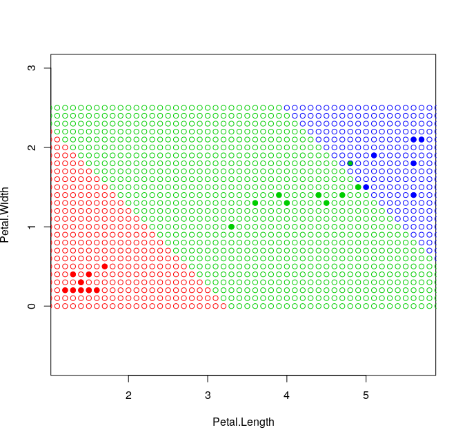
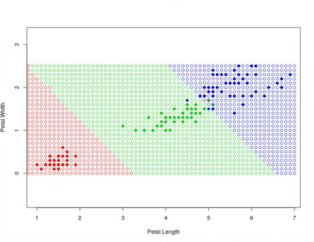
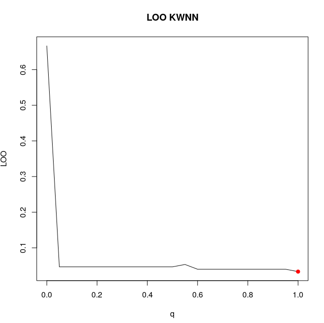
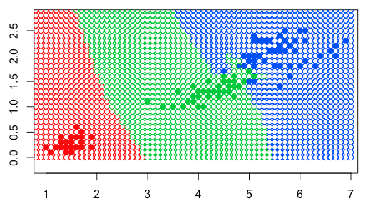
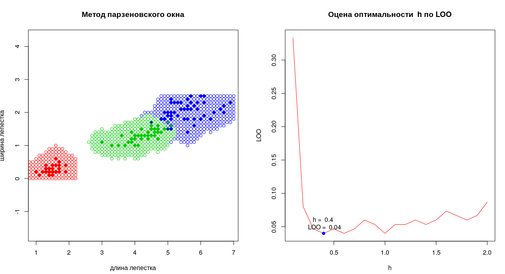
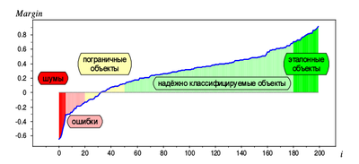

# [Метрические алгоритмы](https://github.com/nastyagolovko/Nastasia/blob/master/README.md#%D0%BC%D0%B5%D1%82%D1%80%D0%B8%D1%87%D0%B5%D1%81%D0%BA%D0%B8%D0%B5-%D0%B0%D0%BB%D0%B3%D0%BE%D1%80%D0%B8%D1%82%D0%BC%D1%8B)

[Алгоритм 1NN](https://github.com/nastyagolovko/Nastasia/blob/master/README.md#%D0%B0%D0%BB%D0%B3%D0%BE%D1%80%D0%B8%D1%82%D0%BC-1nn)

[Алгоритм kNN](https://github.com/nastyagolovko/Nastasia/blob/master/README.md#%D0%B0%D0%BB%D0%B3%D0%BE%D1%80%D0%B8%D1%82%D0%BC-knn)

[Метод парзеновского окна](https://github.com/nastyagolovko/Nastasia/blob/master/README.md#%D0%BC%D0%B5%D1%82%D0%BE%D0%B4-%D0%BF%D0%B0%D1%80%D0%B7%D0%B5%D0%BD%D0%BE%D0%B2%D1%81%D0%BA%D0%BE%D0%B3%D0%BE-%D0%BE%D0%BA%D0%BD%D0%B0)

[Алгоритм СТОЛП (STOLP)](https://github.com/nastyagolovko/Nastasia/blob/master/README.md#%D0%B0%D0%BB%D0%B3%D0%BE%D1%80%D0%B8%D1%82%D0%BC-%D1%81%D1%82%D0%BE%D0%BB%D0%BF-stolp)

[Метод потенциальных функций](https://github.com/nastyagolovko/Nastasia/blob/master/README.md#%D0%BC%D0%B5%D1%82%D0%BE%D0%B4-%D0%BF%D0%BE%D1%82%D0%B5%D0%BD%D1%86%D0%B8%D0%B0%D0%BB%D1%8C%D0%BD%D1%8B%D1%85-%D1%84%D1%83%D0%BD%D0%BA%D1%86%D0%B8%D0%B9)

[Сравнение алгоритмов классификации](https://github.com/nastyagolovko/Nastasia#%D1%81%D1%80%D0%B0%D0%B2%D0%BD%D0%B5%D0%BD%D0%B8%D0%B5-%D0%B0%D0%BB%D0%B3%D0%BE%D1%80%D0%B8%D1%82%D0%BC%D0%BE%D0%B2-%D0%BA%D0%BB%D0%B0%D1%81%D1%81%D0%B8%D1%84%D0%B8%D0%BA%D0%B0%D1%86%D0%B8%D0%B8)

# [Байесовские методы классификации](https://github.com/nastyagolovko/Nastasia#%D0%B1%D0%B0%D0%B9%D0%B5%D1%81%D0%BE%D0%B2%D1%81%D0%BA%D0%B8%D0%B5-%D0%BC%D0%B5%D1%82%D0%BE%D0%B4%D1%8B-%D0%BA%D0%BB%D0%B0%D1%81%D1%81%D0%B8%D1%84%D0%B8%D0%BA%D0%B0%D1%86%D0%B8%D0%B8)

[Линии уровня](https://github.com/nastyagolovko/Nastasia#%D0%BB%D0%B8%D0%BD%D0%B8%D0%B8-%D1%83%D1%80%D0%BE%D0%B2%D0%BD%D1%8F)


# Метрические алгоритмы
# Алгоритм 1NN
Подбирается метрика. В данной работе это декартово расстояние между векторами.
Обучающая выборка сортируется в порядке увеличения расстояния от классифицируемого элемента.
Элемент относят к тому классу к которому принадлежит ближайший (первый в отсортированной выборке) элемент.

<p>
  
## Преимущества:

* простота реализации;

* интерпретируемость решений;

## Недостатки:

* низкое качество классификации;

* приходится хранить всю выборку целиком.

# Алгоритм kNN
Для классификации каждого из объектов тестовой выборки необходимо последовательно выполнить следующие операции:

* Вычислить расстояние до каждого из объектов обучающей выборки

* Отобрать k объектов обучающей выборки, расстояние до которых минимально

* Класс классифицируемого объекта — это класс, наиболее часто встречающийся среди k ближайших соседей
kNN — один из простейших алгоритмов классификации, поэтому на реальных задачах он зачастую оказывается неэффективным. Помимо точности классификации, проблемой этого классификатора является скорость классификации: если в обучающей выборке N объектов, в тестовой выборе M объектов, а размерность пространства — K, то количество операций для классификации тестовой выборки может быть оценено как O(K*M*N). И тем не менее, алгоритм работы kNN является хорошим примером для начала знакомства с Machine Learning.


   
  ``` R
  Задаем евклидовое расстояние
  uclideanDistance <- function(u, v)
   {
   sqrt(sum(u - v)^2)
   }
   ``` 
   
``` R
 Применяем метод kNN 
 kNN <- function(xl, z, k) {    
 
Сортируем выборку согласно классифицируемого объекта     
 orderedXl <- sortObjectsByDist(xl, z)     
 n <- dim(orderedXl)[2] - 1         
 
  Получаем классы первых k соседей    
 classes <- orderedXl[1:k, n + 1] 
```


<p>

Преимущества:

* Программная реализация алгоритма относительно проста.

* Результат работы алгоритма легко поддаётся интерпретации. 

* Возможность модификации алгоритма, путём использования наиболее подходящих функций сочетания и метрик позволяет подстроить алгоритм под конкретную задачу.

Проблемы:

* Модель нельзя "отделить" от данных: для классификации нового примера нужно использовать все примеры. Эта особенность сильно ограничивает использование алгоритма


<p>
  <p>

# Сравнение качества алгоритмов kNN и kwNN.
kNN — один из простейших алгоритмов классификации, поэтому на реальных задачах он зачастую оказывается неэффективным. Основными проблемами классификатора  является точность и скорость классификации: если в обучающей выборке N объектов, в тестовой выборе M объектов, а размерность пространства — K, то количество операций для классификации тестовой выборки может быть оценено как O(KMN).
кации.

```R
Применение метоа kNN и сортировка выборки согласно классифицируемого объекта и ррасстояния
  KWNN <- function(xl, z, k, q) { 
  orderedXl <- sortObjectsByDist(xl, z, euclideanDistance)
 
 
  Метод скользящего контроля для подбора оптимального k
   LOOKWNN <- function(classificator){                    
   j <- 1
   LOO <- seq(1, length(segment))
  
  
  Берем размерность по толбцам и получаем класс первых k соседей
    n <- dim(orderedXl)[2] - 1 
    classes <- orderedXl[1:k, n + 1]
  
  
  Реализация весовой функции
    w <- q ^ i                                             
    m[[classes[i]]] <- m[[classes[i]]] + w                  
  }
```
kwNN отличается от kNN, тем что учитывает порядок соседей классифицируемого объекта, улчшая качество классификации.

# Метод парзеновского окна 
В данном методе мы используем весовую фнкцию как функцию расстояния. Для реаалиации мы используем параметр h, который называем шириной окна. Данный параметр исползуем прмерно так же как и число соседей k.

Програмный код:
```R
parzen <- function(xl, h, distances, type_core) {
 *Оценка весовой функции по расстоянию, а не по рангу; 
 *h- ширина окна; 
 *distances-расстояние от точки z до каждого объекта выборки xl;
 *type_core- текущая функция ядра


Классы объектов выборки и таблица весов классов
  classes <- xl[1:l, n] 
  weights <- table(classes) 
  weights[1:length(weights)] <- 0
  
  
  Прибавляем его вес к общему весу его класса
    r <- distances[i] / h
    weights[class] <- weights[class] + type_core(r) 
  }


Если веса точки по классам не равны 0, то точка попала в окно; возвращаем класс с максимальным весом 
   if (max(weights) != 0) 
      return (names(which.max(weights))) 
   else
      return (0) 
```
<p>

<p>


```R
core.E <- function(r) (3/4)*(1-r^2)*(abs(r) <= 1) Ядро Епанечникова
core.Q <- function(r) (15/16)*((1 - r^2)^2)*(abs(r) <= 1) Квадратичесское ядро
core.T <- function(r) (1 - abs(r))*(abs(r) <= 1) Треугольное ядро
core.G <- function(r) (2*pi)^(-0.5)*exp(-0.5*(r^2)) Гауссовское ядро
core.P <- function(r) (0.5)*(abs(r) <= 1) Прямоугольное ядро
```

## Преимущества 
* При классификации объекта заодно оцениваются априорные вероятности его принадлежности каждому из классов. Эта информация используется во многих приложениях для оценки рисков.
* Байесовское решающее правило удобно использовать в качестве эталона при тестировании алгоритмов классификации на модельных данных.
## Недостатки 
* На практике функции правдоподобия классов приходится восстанавливать по конечным выборкам данных. После подстановки восстановленной плотности в формулу байесовский классификатор перестаёт быть оптимальным.
* Методов восстановления плотности известно довольно много. Однако ни один из них не является безусловно лучшим. В практических задачах метод восстановления приходится подбирать экспериментальным путём.

# Алгоритм СТОЛП (STOLP)
Алгоритм СТОЛП (STOLP) — алгоритм отбора эталонных объектов для метрического классификатора. 
Результатом работы алгоритма являетя разбиене обучающих объектов на 3 категории: шумовые, эталонные и неинформативные Если гипотеза компактности верна. то выборка достаточно велика, то основная масса обучающх объктов окажется наинфоративной и будет отброшена. Фактически, этот алгоритм выполняет сжатие исодных даных.
<p>

# Метод потенциальных функций  
Метрический классификатор, частный случай метода ближайших соседей. Позволяет с помощью простого алгоритма оценивать вес объектов обучающей выборки при решении задачи классификации. 

В процессе обучения с каждой точкой пространства изображений, соответствующей единичному объекту из обучающей последовательности, связывается функция U(X, Xi), заданная на всем пространстве и зависящая от Xi как от параметра. Такие функции называются потенциальными, так как они напоминают функции потенциала электрического поля вокруг точечного электрического заряда. Изменение потенциала электрического поля по мере удаления от заряда обратно пропорционально квадрату расстояния. Потенциал, таким образом, может служить мерой удаления точки от заряда. Когда поле образовано несколькими зарядами, потенциал в каждой точке этого поля равен сумме потенциалов, создаваемых в этой точке каждым из зарядов. Если заряды, образующие поле, расположены компактной группой, потенциал поля будет иметь наибольшее значение внутри группы зарядов и убывать по мере удаления от нее.

* Достоинства метода потенциальных функций заключаются в нелинейном разбиении множества объектов. Что позволяет решать задачи, которые сложно решить другими методами.
* Недостатки — в трудном выборе подходящей потенциальной функции и трудоемкости вычислений, при большом объеме обучающей выборке.


## Сравнение алгоритмов классификации

<table>
<tr>
<td>Метод 1</td>
<td> 1NN </td>
<td> KNN </td>
<td> KWNN </td>
<td> Парзеновское окно </td>
</tr>
<tr>
<td> Параметры</td>
<td>  </td>
<td> К=6 </td>
<td> K=9 </td>
<td> h=0,4; h=0,1 (Гауссовское) </td>
</tr>
<tr>
<td> Величина ошибок</td>
<td> 0,47 </td>
<td> 0,33 </td>
<td> 0,33 </td>
<td> 0,4 </td>
</tr>
</table>


# Байесовские методы классификации
Если плотность распределения классов известны, то алгоритм классификации,имеющий миимальную вероятность ошибок,можно выплнить в явном виде.
* Априаорная вероятность-вероятность появления объектов каждого из класса. 
* Условная верятность P(y(x)) называется апостериорной вероятностью класса у для объекта х. 

# Линии уровня

Вероятностное распределение с плотностью называется n-мерным нормальным(Гауссовским) распределенем с мат.ожиданием (центром)  и ковариационной матрицей.

<p>

<p>
  
  
<p>
