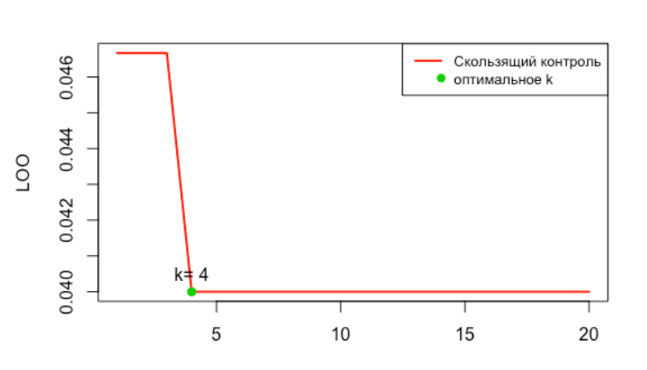

# Метрические алгоритмы
# Алгоритм 1NN
Подбирается метрика. В данной работе это декартово расстояние между векторами.
Обучающая выборка сортируется в порядке увеличения расстояния от классифицируемого элемента.
Элемент относят к тому классу к которому принадлежит ближайший (первый в отсортированной выборке) элемент.

## Преимущества:

* простота реализации;

* интерпретируемость решений;

## Недостатки:

* низкое качество классификации;

* приходится хранить всю выборку целиком.

# Алгоритм kNN
Для классификации каждого из объектов тестовой выборки необходимо последовательно выполнить следующие операции:

* Вычислить расстояние до каждого из объектов обучающей выборки

* Отобрать k объектов обучающей выборки, расстояние до которых минимально

* Класс классифицируемого объекта — это класс, наиболее часто встречающийся среди k ближайших соседей
kNN — один из простейших алгоритмов классификации, поэтому на реальных задачах он зачастую оказывается неэффективным. Помимо точности классификации, проблемой этого классификатора является скорость классификации: если в обучающей выборке N объектов, в тестовой выборе M объектов, а размерность пространства — K, то количество операций для классификации тестовой выборки может быть оценено как O(K*M*N). И тем не менее, алгоритм работы kNN является хорошим примером для начала знакомства с Machine Learning.

Преимущества:

Программная реализация алгоритма относительно проста.

Результат работы алгоритма легко поддаётся интерпретации. 

Возможность модификации алгоритма, путём использования наиболее подходящих функций сочетания и метрик позволяет подстроить алгоритм под конкретную задачу.

Проблемы:

Модель нельзя "отделить" от данных: для классификации нового примера нужно использовать все примеры. Эта особенность сильно ограничивает использование алгоритма

# Сравнение качества алгоритмов kNN и kwNN.
kNN — один из простейших алгоритмов классификации, поэтому на реальных задачах он зачастую оказывается неэффективным. Основными проблемами классификатора  является точность и скорость классификации: если в обучающей выборке N объектов, в тестовой выборе M объектов, а размерность пространства — K, то количество операций для классификации тестовой выборки может быть оценено как O(KMN).
kwNN отличается от kNN, тем что учитывает порядок соседей классифицируемого объекта, улчшая качество классификации.

# Метод парзеновского окна 
Метод байесовской классификации, основанный на непараметрическом восстановлении плотности по имеющейся выборке. 
После ввода метрики, метод парзеновского окна можно использовать, не опираясь на вероятностную природу данных. 
## Идея метода 
В основе подхода лежит идея о том, что плотность выше в тех точках, рядом с которыми находится большое количество объектов выборки. 
Если мощность множества элементарных исходов много меньше размера выборки, то в качестве восстановленной по выборке плотности мы вполне можем взять и гистограмму значений выборки. 
В противном случае (например, непрерывном) данный подход не применим, так как плотность концентрируется вблизи обучающих объектов, и функция распределения претерпевает резкие скачки. Приходится использовать восстановление методом Парзена-Розенблатта. 

## Преимущества 
* При классификации объекта заодно оцениваются априорные вероятности его принадлежности каждому из классов. Эта информация используется во многих приложениях для оценки рисков.
* Байесовское решающее правило удобно использовать в качестве эталона при тестировании алгоритмов классификации на модельных данных.
## Недостатки 
* На практике функции правдоподобия классов приходится восстанавливать по конечным выборкам данных. После подстановки восстановленной плотности в формулу байесовский классификатор перестаёт быть оптимальным.
* Методов восстановления плотности известно довольно много. Однако ни один из них не является безусловно лучшим. В практических задачах метод восстановления приходится подбирать экспериментальным путём.
